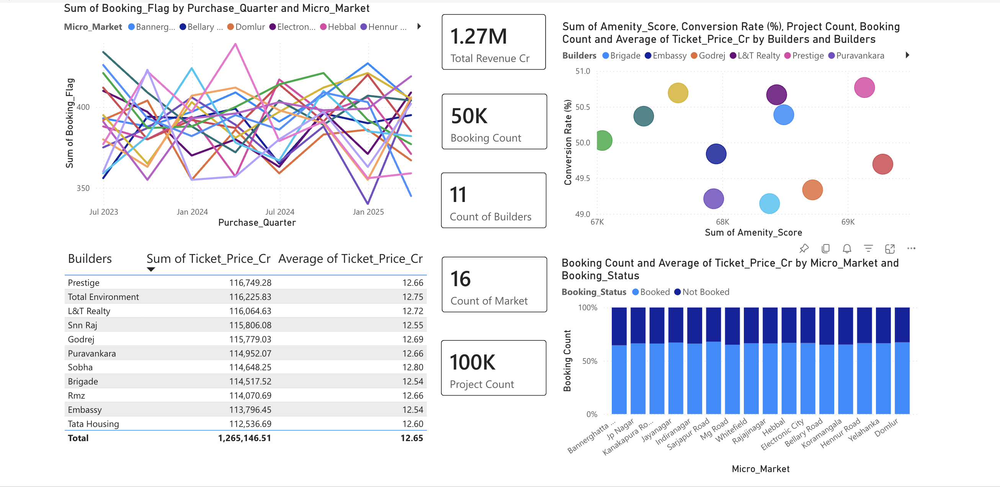
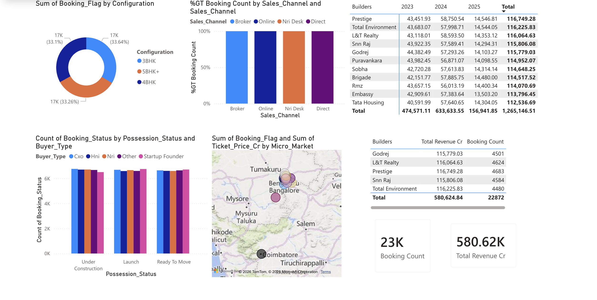

# 🏙️ Luxury Housing Sales Analysis – Bengaluru

An end-to-end **Real Estate Analytics & Business Intelligence project** that replicates a real-world enterprise data pipeline using **Python, SQL, and Power BI**.  
This project analyzes **100,000+ luxury housing records** in Bengaluru to uncover market trends, booking behavior, builder performance, and pricing insights.

---

## 📌 Project Objective

To build a complete analytics solution that:
- Cleans and transforms raw real estate data using Python
- Loads refined data into a relational SQL database
- Connects Power BI directly to SQL for live dashboards
- Generates actionable business insights for real estate decision-makers

---

## 🧠 Business Use Cases

- **Market Intelligence**: Identify high-performing micro-markets and builder trends  
- **Sales Optimization**: Analyze booking conversion and drop-off patterns  
- **Buyer Persona Analysis**: Segment buyers by type and behavior  
- **Competitive Pricing**: Compare pricing strategies across builders  
- **Amenity Impact**: Measure correlation between amenities and booking success  
- **Quarterly Trend Tracking**: Monitor market performance across fiscal quarters  

---

## 🛠️ Tech Stack

| Layer | Tools |
|------|------|
| Data Cleaning & EDA | Python (Pandas, NumPy) |
| Database | MySQL / PostgreSQL |
| Data Ingestion | SQLAlchemy |
| BI & Visualization | Power BI |
| Version Control | Git & GitHub |

---

## 🔄 Project Workflow

### 🐍 Step 1: Data Cleaning & Feature Engineering (Python)
- Load raw CSV dataset (100,000+ rows)
- Handle missing values and inconsistent formats
- Normalize categorical fields (Builder, Micro_Market)
- Create derived features:
  - `Price_per_Sqft`
  - `Booking_Flag`
  - `Year`, `Quarter`, `Quarter_Number`
- Export clean data for database insertion

### 🧠 Step 2: SQL Data Warehousing
- Design optimized SQL table schema
- Insert cleaned data using SQLAlchemy
- Run validation and aggregation queries:
  - Total record count
  - Booking conversion rate
  - Builder-wise average ticket price

### 📊 Step 3: Power BI Dashboard
- Live connection to SQL database
- DAX measures for KPIs and conversion metrics
- Interactive visuals with slicers and filters
- Insight-driven dashboards for business users

---

## 📈 Power BI Dashboard Insights

- Quarterly booking trends by micro-market  
- Builder-wise total revenue and average ticket size  
- Amenity score vs booking conversion (scatter analysis)  
- Micro-market booking conversion comparison  
- Configuration demand analysis (3BHK, 4BHK, etc.)  
- Sales channel efficiency  
- Top 5 builders by revenue and booking success  
- Geographic concentration of luxury housing projects  

---
### 📊 Dashboard Overview



## 📂 Repository Structure

```text
Luxury-Housing-Analytics/
│
├── luxury_housing.pbix
│
├── Luxury_Housing_Data_Cleaning_ETL.ipynb
│
├── Luxury Housing Bangalore_Raw.csv
│
├── Luxury_Housing_Bangalore_Cleaned.csv
│
├── dashboard_overview_1.png
│
├── dashboard_overview_2.png
│
├── README.md
│
└── requirements.txt
